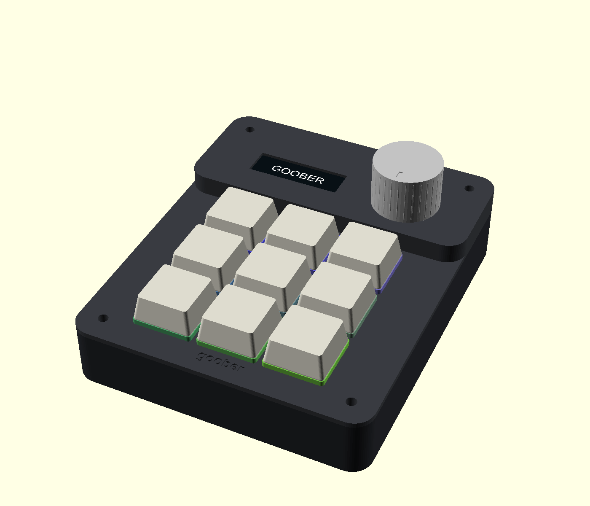

# goober

A compact 9-key USB-C macro pad with MX hot-swap switches, an OLED, a volume/mute knob and individually addressable RGB lighting. RP2040-Zero + QMK. **USB hub and charging passthrough are deferred.**

**Rev A.1 is a checked engineering prototype, ready for a first fabrication and fit test. It has not yet been built or electrically tested on hardware.**

## Start here

1. Read [the design plan](docs/DESIGN_PLAN.md) and [parts/cost list](docs/PARTS_AND_COST.md).
2. Use [the fabrication guide](docs/FABRICATION.md) to order a small PCB batch.
3. Print the fit coupon, then follow [assembly and testing](docs/ASSEMBLY_AND_TEST.md).
4. Flash the supplied UF2. [Software and firmware instructions](docs/SOFTWARE_AND_FIRMWARE.md) explain editing and rebuilding.

KiCad, OpenSCAD and the firmware build tools are already installed on this Mac. You only need an optional printer slicer if printing at home. Your remaining work is choosing switches/keycaps, buying parts, printing or ordering the enclosure, soldering and testing the physical prototype.

## Files

| Deliverable | Location |
|---|---|
| Bare-board manufacturing ZIP | [Goober-Rev-A-Gerbers.zip](hardware/Goober-Rev-A-Gerbers.zip) |
| Editable PCB/schematic | [KiCad project](hardware/goober.kicad_pro) — keep adjacent files/libraries together |
| Printable case | [Base](case/goober-base.stl), [lid](case/goober-lid.stl), [knob](case/goober-knob.stl), [fit coupon](case/goober-fit-coupon.stl) |
| Editable case | [OpenSCAD source](case/goober.scad) |
| Ready-to-flash firmware | [Goober UF2](firmware/build/goober-rev-a-default.uf2) |
| Firmware source | [Default keymap](firmware/goober/rev_a/keymaps/default/keymap.c), plus board files in `firmware/goober/rev_a/` |
| Mockups | [Actual CAD](mockups/goober-cad.png), [exploded CAD](mockups/goober-exploded.png), [appearance concept](mockups/goober-appearance.png) |
| Parts list | [Guide](docs/PARTS_AND_COST.md), [CSV](hardware/BOM.csv) |
| Checks and remaining tests | [Validation record](docs/VALIDATION.md) |

The design passes schematic ERC, PCB DRC and KiCad schematic/PCB parity with zero issues. Firmware compiles; the base, lid and knob are watertight single-body meshes. The release includes the detailed validation results and checksums.

The archive in `releases/` contains the deliverables and editable project, without the large installed tools and upstream source checkouts. License/provenance notes are in [NOTICE.md](NOTICE.md).
